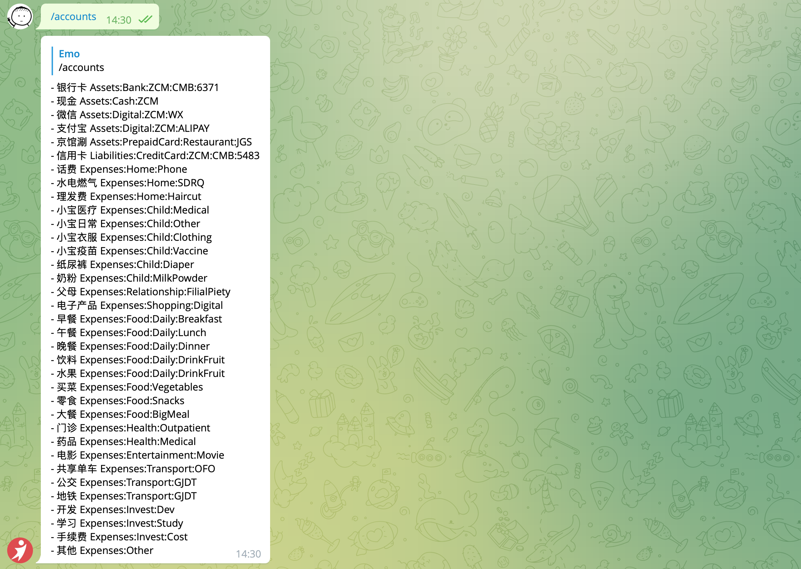
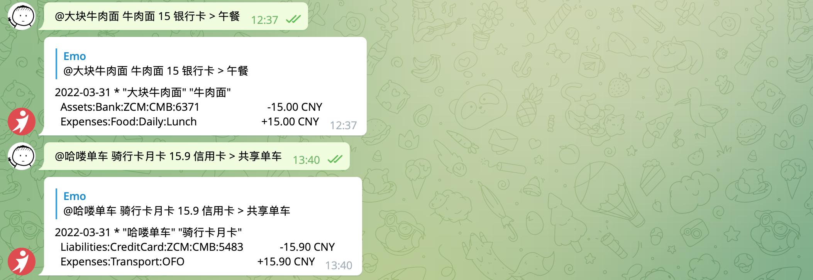

## The way to build telegram bot

## Usage

### List account



### Record bill



### Set bot webhook url

```bash
curl -X POST https://api.telegram.org/bot<YOUR-BOT-TOKEN>/setWebhook -H "Content-type: application/json" -d '{"url": "https://your-ngrok-subdomain.ngrok.io/api/webhook"}'
```

### start vercel with telegram bot token environment

```bash
TELEGRAM_BOT_TOKEN=<YOUR-BOT-TOKEN> vercel dev
```

Reference: <https://www.marclittlemore.com/serverless-telegram-chatbot-vercel/>

